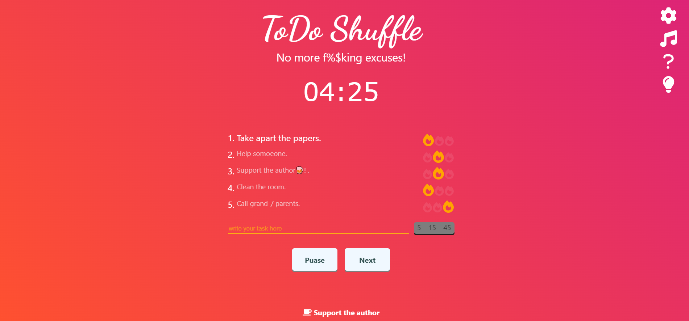

# TODO Shuffle APP (React + Redux + Typescript).
[DEMO LINK](https://todo-shuffle.com/)

## Description
 this todo app is mix from pomodoro and simple to do list. It's really strict, you can't cancel the task or change it. That's why it helps to fight procrastination.
 

## How it works. 
1. Add up to 5 todo tasks. Or add nothing. 
2. Push button "Start"
 

## Technologies Used
1. React
2. react-helmet
3. Redux
4. React hooks
5. Typescript
6. [fontawesome](https://fontawesome.com/) 
7. Css + html. 

## Features
1. Timer 
2. Todo-list. 
3. Simple UI
4. Settings where you can change duration of every period. 
5. random todo from array. Just push start or one of button and you will see. 
6. All icons are from font awesome library. 

## Lessons Learned During Development
- First of all I learned how to use Typescript.
- I learned how to use hooks, like useEffect and useState. useEffect demands sometime a  lot of patience.
- I also learned how make simple UI system with help of Redux.   
- Learned react-helmet library. It helps change tag in <head> of the site. 
- Now I know how to deploy sites on server.
- Learned setInterval and setTimeout js functions. 
- I knew now that pure css has some restictions when it related to animation. Css don't know positions of elements, unfortunately because of this issue, the app looks not so interesting. 

## Planned Features
1. Add dark mode. I suppose, current color scheme could be not appropriate for every user.   
2. Add work with cookies and local storage. Timer should be be paused if site will be closed. And also It would be great to remember current todolist. 
3. Integrate google analytics 
4. Site needs some optimization
5. Code needs refactoring

